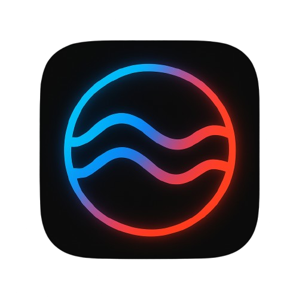

  
  <h1>Flowday</h1>
  
<strong>Your day distilled into color, emojis, and a vibe.</strong>

  
A 20‑second ritual that turns feelings into flowing visuals worth keeping and sharing.

## Why Flowday?

Most journals want essays. Habit trackers reduce mood to numbers.  
**Flowday captures a visual memory thread in seconds:**

- Pick up to three emojis  
- Slide to a color  
- (Optional) Add a song title + artist  

From these tiny inputs, Flowday creates:

- **Weekly flowing ribbons** (7‑day wave)  
- **Monthly continuous mixes** (a single ribbon that reflects dominant hues)  
- **Emoji constellations** (your emotional sky)  
- **Song Echoes** (cassette‑style snapshots)

No calendars. No streaks. Just ambient reflection.

## Principles

1. **Frictionless** – quicker than replying to a text.  
2. **Feels like art** – outputs look poster‑ready by default.  
3. **Local‑first** – entries stay on your device unless you opt in.  
4. **Human tone** – playful, not clinical or gamified.

## Features

- **Today** – Emoji triangle + aura; calm when saved, inviting when empty.  
- **Flows** –  
  - *Week Flow*: 7 blended bands in a soft wave.  
  - *Month Mix*: luminous ribbon weighted by hue frequency (not a timeline).  
- **Constellations** – Top emojis become nodes; co‑occurrences connect them. Opacity tracks recency.  
- **Echoes** – Days with songs show as cassette cards (title + artist).  
- **Export / Import** – JSON file with all entries, user, recents, and reminder prefs.

## Tech stack

- **Client:** React + TypeScript + Vite, TailwindCSS.  
- **Telegram Mini App:** WebApp integration + Bot API.  
- **Backend:** Vercel Serverless Functions.  

## License  

The source code in this repository is licensed under the MIT License (see `LICENSE`).

> Flowday is a daily glance inward — memory carried forward in color.
